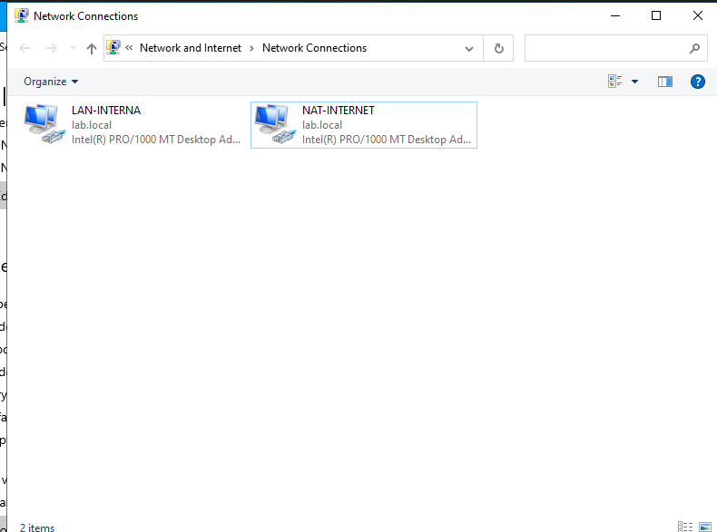
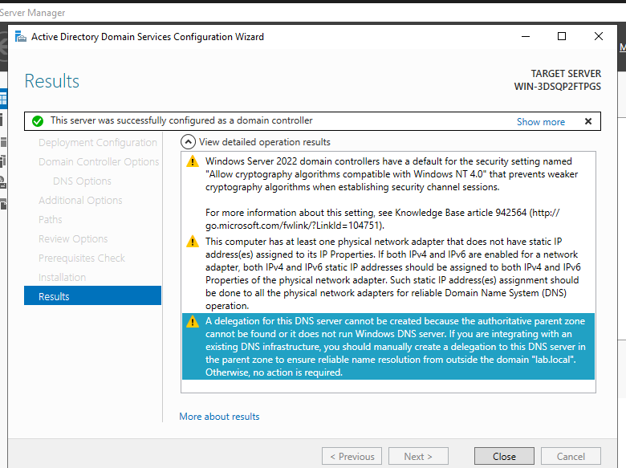
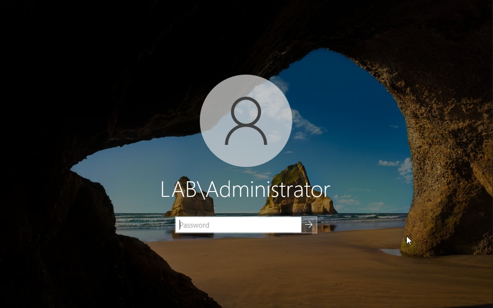
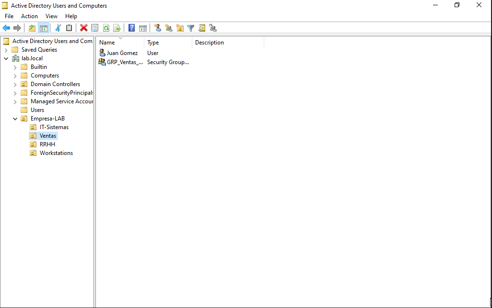
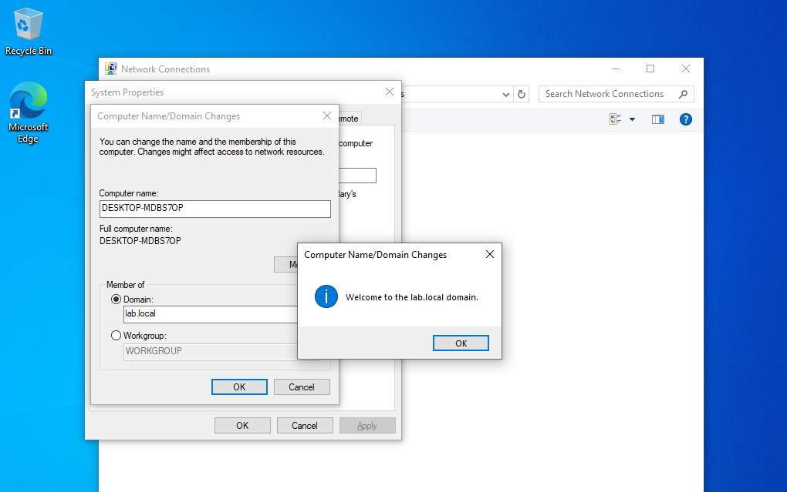
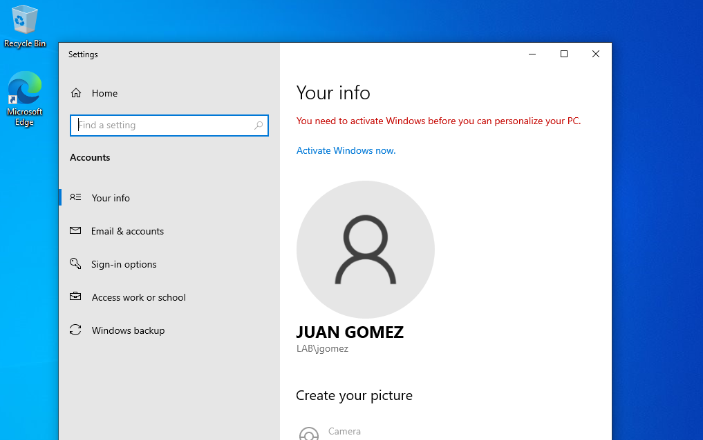
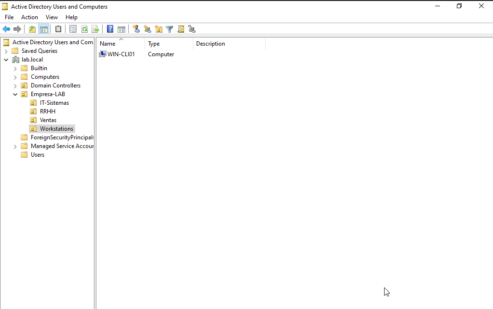

# Laboratorio Corporativo de Soporte IT & Active Directory

##  Descripción del Proyecto
Implementación de un entorno corporativo virtualizado para simular la infraestructura de red, gestión de identidades, políticas de seguridad y mesa de ayuda de una empresa.

##  Tecnologías Utilizadas
* **Hipervisor:** Oracle VirtualBox 7.x
* **Servidor de Directorio:** Windows Server 2022 (Standard / Desktop Experience)
* **Cliente:** Windows 10 Pro
* **Servicios de Red:** Active Directory Domain Services (AD DS), DNS local, DHCP/IP estática

##  Arquitectura de Red y Direccionamiento

* **Nombre de Red Interna (VirtualBox):** `lab-red`
* **Dominio Corporativo:** `lab.local`
* **NetBIOS:** `LAB`

| Equipo | Rol | Adaptador de Red | Dirección IP | Máscara | DNS Preferido |
| :--- | :--- | :--- | :--- | :--- | :--- |
| **SRV-DC01** | Controlador de Dominio (AD/DNS) | 1. NAT 2. Red Interna (`lab-red`) | DHCP (Internet) `192.168.10.1` | — `255.255.255.0` | — `127.0.0.1` |
| **WIN-CLI01** | Estación de Trabajo Cliente | 1. Red Interna (`lab-red`) | `192.168.10.20` | `255.255.255.0` | `192.168.10.1` |

## Fases Implementadas

### Fase 1: Aislamiento de Red e Instalación Base
1. Creación del switch virtual aislado (`lab-red`) en VirtualBox para garantizar tráfico seguro entre hosts sin interferir con la red física doméstica.
2. Despliegue de la máquina virtual **Windows Server 2022** con doble interfaz de red:
   * Adaptador 1 (NAT) para descarga de actualizaciones.
   * Adaptador 2 (Red Interna) para servicios del dominio corporativo.

### Fase 2: Configuración de Red e Instalación de AD DS & DNS
1. Asignación de direccionamiento IP estático en la interfaz LAN (`192.168.10.1/24`) con loopback DNS (`127.0.0.1`).
2. Instalación de los roles de servidor:
   * **Active Directory Domain Services (AD DS)**
   * **Servidor DNS**
3. Promoción del servidor a primer Controlador de Dominio raíz de un nuevo bosque (`lab.local`).

### Fase 3: Estructuración de Identidades (OUs, Grupos y Usuarios)
1. Creación de la Unidad Organizativa raíz (`Empresa-LAB`) para contener la estructura departamental.
2. Creación de sub-OUs correspondientes a cada área: `IT-Sistemas`, `Ventas`, `RRHH` y `Workstations`.
3. Creación de grupos de seguridad globales (ej. `GRP_Ventas_Acceso`) para la asignación controlada de permisos.
4. Creación y asignación de usuarios de prueba con requisitos de cambio de contraseña en el primer inicio de sesión.

### Fase 4: Puesta en marcha de máquina cliente y unión al dominio

1. Despliegue de Windows 10 Pro en la máquina virtual cliente.
2. Asignación de IP estática (192.168.10.20), puerta de enlace (192.168.10.1) y servidor DNS apuntando al Controlador de Dominio.
3. Cambio de nombre del equipo a `WIN-CLI01` y unión exitosa al dominio `lab.local`.
4. Primer inicio de sesión en el cliente utilizando las credenciales corporativas del usuario de prueba (`LAB\jgomez`).
5. Reubicación del objeto de la máquina cliente dentro de la Unidad Organizativa (OU) dedicada `Workstations` desde el DC.

## Evidencias

### 1. Configuración de interfaces de red

### 2. Promoción exitosa a controlador de dominio

### 3. Inicio de sesión en el dominio corporativo

### 4. Estructura OU creada

### 5. Unión del cliente al dominio

### 6. Inicio de sesión exitoso con usuario de dominio (WIN-CLI01)

### 7. Equipo (WIN-CLI01) movido a OU "Workstations"

## Troubleshooting

* **Comportamiento "Sin acceso a Internet" en placa LAN:**
  * *Observación:* La interfaz interna muestra conectividad limitada / sin internet.
  * *Causa:* Al tratarse de una subred aislada sin puerta de enlace (Default Gateway) hacia el exterior, Windows clasifica la red como no identificada. El tráfico local opera correctamente.
* **Advertencia de Delegación DNS durante la promoción:**
  * *Observación:* El asistente indica que no se pudo crear una delegación para el servidor DNS autoritativo primario.
  * *Resolución:* Según lo averiguado es el comportamiento estándar esperado al crear el primer controlador de dominio raíz de un bosque nuevo sin infraestructura DNS superior previa.
* **Falso positivo de "Sin acceso a internet":**
  * *Observación:* El icono de red indica conectividad limitada/sin acceso, a pesar de que el ping y la navegación web responden con éxito.
  * *Resolución:* No es una falla real. Se verificó conectividad real mediante comandos en terminal y se confirmó que todo funciona como debe.
* **Asignación de nombre genérico en equipo cliente:**
  * *Observación:* Tras la instalación de Windows 10, la máquina conservó el nombre alfanumérico por defecto (ej. DESKTOP-XXXXXXX), lo cual ensucia el registro en Active Directory.
  * *Resolución:* Se modificó el nombre del equipo manualmente desde las Propiedades del Sistema (`sysdm.cpl`) a `WIN-CLI01` utilizando credenciales de administrador, y se reinició la máquina virtual para impactar el cambio antes de finalizar la unión al dominio.

---
